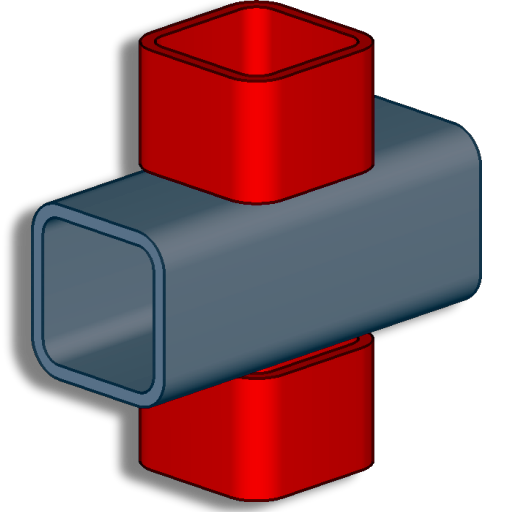

[Contents](README.md) | [Concepts](core-concepts/overview.md) | [Configuration](configuration/overview.md) | [Main Window](user-interface/main-window.md) | [Audits](user-interface/audits-window.md) | [Examples](examples/overview.md) | [Troubleshooting](troubleshooting/overview.md)

---

# ObChecked Documentation 

> *Published By Chloe Garcia*

*Documentation and usage guide for the Tekla Structures Extension — ObChecked Version 2*

<table>
<tr>
<td width="120">

</td>
<td>

Welcome to the documentation for <b>ObChecked</b>.
 
 
This repository contains documentation and examples for <b>ObChecked</b>.

</td>
</tr>
</table>

## Documentation Contents

- [Overview](overview.md)
- [Getting Started](getting-started.md)
- [Core Concepts](core-concepts/overview.md)
  - [Subject Node](core-concepts/subject.md)
  - [Match Node](core-concepts/match.md)
  - [Target Node](core-concepts/target.md)
    - [StringCases](core-concepts/target-stringcases.md)
    - [NumericBands](core-concepts/target-numericbands.md)
    - [StringCompare](core-concepts/target-stringcompare.md)
    - [NumericCompare](core-concepts/target-numericcompare.md)
    - [Direct](core-concepts/target-direct.md)
  - [Condition Node](core-concepts/condition.md)
- [Configuration](configuration/overview.md)
  - [Firm Folder Setup](configuration/firm-folder.md)
  - [Column Definitions](configuration/column-definitions.md)
  - [File Locations](configuration/file-locations.md)
- User Interface
  - [Main Window](user-interface/main-window.md)
  - [Audit Definition Editor](user-interface/audit-definition-editor.md)
- [Examples](examples/overview.md)
  - [Rule Design Patterns](examples/rule-design-patterns.md)
  - [Profile Rule Examples](examples/profile/overview.md)
  - [Name Rule Examples](examples/name/overview.md)
  - [Common Rule Examples](examples/common/overview.md)
- [Troubleshooting](troubleshooting/overview.md)
- [Complete file list](docs-index.md)

---

> ObChecked is a signed extension and is distributed as a verified build.

The source code for ObChecked is not public.

Documentation is licensed under **Creative Commons Attribution 4.0 (CC BY 4.0)**.
