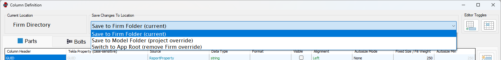

---
---



<!-- [Contents](../README.md) | [Concepts](../core-concepts/overview.md) | [Configuration](../configuration/overview.md) | [Main](../user-interface/main-window.md) | [Audits](../user-interface/audit-definition-editor.md) | [Examples](../examples/overview.md) | [Troubleshooting](../troubleshooting/overview.md) -->

# File Locations

ObChecked allows configuration files to be stored in several different locations depending on how the configuration should be shared.

The available locations are:

- Application Root
- Firm Folder
- Model Folder

These locations follow the same precedence logic used by Tekla environments.

---

# Configuration Priority

When ObChecked starts, it searches for configuration files using the following order:

1. Model Folder
2. Firm Folder
3. Application Root

The first configuration found in this order becomes the **active configuration**.

Example behaviour:

If a column configuration exists in the model folder, that configuration will always be used.

If no configuration exists in the model folder, ObChecked will check the firm folder.

If neither location contains a configuration file, the application will fall back to the configuration stored in the application root.

This behaviour mirrors how Tekla resolves environment files.

---

# Application Root

The **Application Root** is the default location bundled with the ObChecked extension.

This folder exists locally on each workstation and contains the baseline configuration used when no overrides are present.

Typical use cases include:

- personal configuration
- initial column definitions
- development or testing setups

---

# Firm Folder

If the firm folder has been configured, an option will appear allowing configuration to be saved to the **Firm Folder**.

The firm folder allows configuration files to be shared across multiple users in the same Tekla environment.

Once configuration files are copied to the firm folder, all users connected to that firm environment can use the same definitions.

---

# Model Folder

The model folder allows configuration to be overridden for a specific project.

When configuration files are saved to the model folder, they will take priority over both the firm folder and application root.

This is useful when a particular project requires:

- project-specific audit rules
- custom column definitions
- temporary validation checks

---

# Saving Configuration

When editing column definitions or audit files, configuration changes must first be saved.

If the firm folder has been configured, the following options may be available:

- Save to Firm Folder
- Save to Model Folder

Saving to these locations copies the configuration files to the selected directory so they become the active configuration according to the priority rules.

---

# Switching Configuration Location

If configuration files already exist in a higher-priority location, additional options become available.

These may include:

- Switch to Firm Folder
- Switch to App Root

When switching locations, ObChecked will:

1. Create a backup of the existing configuration
2. Remove the files from the current location
3. Save the configuration to the selected location

This ensures the configuration hierarchy remains consistent and avoids conflicting definitions.

---

# Configuration Behaviour

The configuration system is designed to make it easy to transition between local, shared, and project-specific setups.

However, it intentionally remains strict about where configuration files are stored so that the active configuration is always predictable.

At present, the available configuration locations are limited to:

- Application Root
- Firm Folder
- Model Folder

Additional configuration options may be considered in future versions if more flexibility is required.

---

# Typical Workflow

A common workflow when introducing ObChecked to a team may look like this:

1. Configure the firm folder location
2. Define column definitions
3. Save column definitions to the firm folder
4. Create shared audit rules
5. Use the model folder only when project-specific overrides are required

This allows teams to maintain consistent validation rules while still supporting exceptions where necessary.

---

# Related Configuration

See also:

- [Firm Folder Setup](firm-folder.md)
- [Column Definitions](column-definitions.md)
