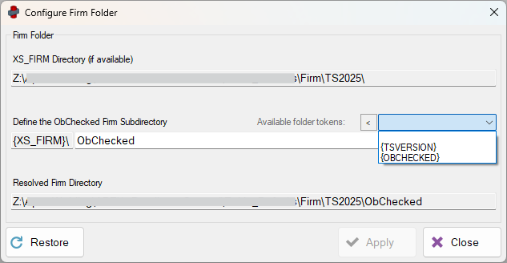

---
---



<!-- [Contents](../README.md) | [Concepts](../core-concepts/overview.md) | [Configuration](../configuration/overview.md) | [Main](../user-interface/main-window.md) | [Audits](../user-interface/audit-definition-editor.md) | [Examples](../examples/overview.md) | [Troubleshooting](../troubleshooting/overview.md) -->

---

# Firm Folder Setup

ObChecked supports using a **shared firm folder** so configuration files can be maintained centrally and accessed by multiple users.

If Tekla's `XS_FIRM` environment variable is defined and accessible, the **Configure Firm Folder** dialog becomes available in ObChecked.

This allows users to define a shared location inside the firm's Tekla environment where ObChecked configuration files can be stored.

---

## Purpose of the Firm Folder

The firm folder allows teams to maintain **consistent configuration across multiple workstations**.

Typical items stored in the firm folder include:

- Column Definitions
- Audit Rule Definitions
- Shared configuration files

Once configured, updates made to these files can be shared across all users connected to the same firm environment.

---

## Firm Folder Structure

Although the firm folder root is defined by Tekla, it is recommended to create a **dedicated subdirectory for ObChecked**.

Example:

```
XS_FIRM
└─ ObChecked
  ├─ ColumnConfig.json
  ├─ Parts_PROFILE.aud
  └─ etc...
```

This keeps ObChecked configuration separate from other Tekla environment files.

The subdirectory can be customised to suit the structure of your firm's environment.

---

## Subdirectory Configuration

The dialog allows a **custom subdirectory path** to be specified inside the firm folder.

This makes it possible to:

- store configuration in a dedicated ObChecked folder
- organise configurations by Tekla version
- adapt to existing firm folder structures



---

## Tokens

The subdirectory path supports **tokens**, which can automatically resolve environment values.

Currently supported tokens include:

| Token | Description |
|--|--|
| `{TSVERSION}` | Inserts the current Tekla version |
| `{OBCHECKED}` | Inserts the default ObChecked subdirectory name |

A dropdown menu is available in the dialog to insert supported tokens.

> Note: The Tekla version token may currently include the service pack version. Future updates may simplify this to the main version number only.

It is also possible that the Tekla version is already included in the Firm folder path in which case it may not be necessary to include.

*If separated by Tekla version, changes in one version will not apply to another version. At the moment, changes will need to be made in each version independently.*

Additional tokens may be added in future releases if required.

---

## Folder Preview

The dialog includes a **preview field** showing the resolved firm folder path based on the current settings.

This preview helps confirm:

- the correct folder structure
- token resolution
- final directory location

---

## Creating the Folder

If the resolved directory does not exist, the dialog will display a **Create** button.

Selecting this will create the required directories inside the firm folder so ObChecked can store configuration files there.

---

## Workstation Setup

The firm folder configuration must be set up **on each workstation** running ObChecked.

Once configured correctly, the shared folder allows:

- column definitions to be updated centrally
- audit rules to be shared across users
- configuration changes to propagate more easily across the team

---

# Related Configuration

See also:

- [File Locations](file-locations.md)
- [Column Definitions](column-definitions.md)

