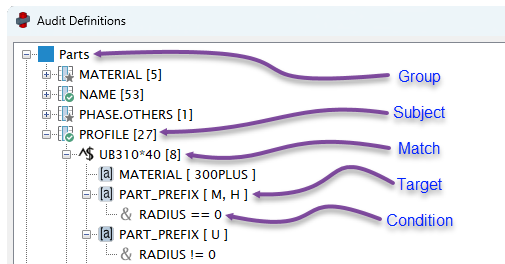

# Core Concepts

ObChecked audits are built using a structured rule hierarchy.

This hierarchy allows complex validation rules to be constructed in a clear and modular way. Each level progressively narrows the scope of the rule until a specific value can be evaluated.

The audit structure follows this sequence:

```
Group → Subject → Match → Target → Condition
```

Understanding how these nodes work together is the key to building effective audit definitions.



*Audit Definition form showing an example of each node in sequence.*

---

## Group

Audit rules are first organised by their object type (Parts, Bolts, Components), because they have access to different model object properties.

Groups do not perform validation themselves. Instead, they act as containers for the rules that follow.

---

## Subject

A **Subject** defines the main property that determines if a row/object is recognised and able to be audited.

Subjects are a container for a collection of _Match_ nodes, because audit rules may vary for different values of the subject cell.

For example, a subject column may be *PROFILE*, so each _Match_ node in a subject will try to match a different type of *PROFILE*.

Subjects are the starting point for rule logic.

See: [Subject](subject.md)

---

## Match

A **Match** node simply identifies a recognised _Subject_ value.

Matches evaluate the value in the subject cell and decide whether the rule continues.

Matches can use basic wildcards for batch matching.
- _e.g. `PL*` to match `PLATE8*200`_

Matches can also use regex for complex matching.
- _e.g. `^(PLATE)(\d{1,2})\*(\d{2,4})$` to match `PLATE10*200` and return `10` and `200` for use in conditions_

Matches are a container for a collection of _Target_ nodes, which are run on a successful match of the subject cell.

See: [Match](match.md)

---

## Target

Each **Target** defines one cell that will be validated if the match condition is satisfied.

Target nodes have several methods to determine how a cell is audited, and provides a variety of possible outcomes for each audit.

Target nodes can compare the value of its cell against a list of acceptable strings, a range of acceptable numbers, comparisons against other cells or direct checks against being empty/not empty.

See: [Target](target.md)

---

## Condition

A **Condition** is a way to limit a Target node to only run under certain conditions.

This is to allow several Target nodes for the *same cell*, but are instructed to run under different conditions.

For example, available stock lengths of a profile may be dependent on the profile depth, `UB200*18` vs `UB310*40`. By using a different condition under each Target node, you can control which max length rules applies to which profile depth.

See: `condition.md` *coming soon*

---

## How the Hierarchy Works

Each level in the hierarchy refines the rule.

Example:

```
Subject: PROFILE
Match: ^(UB)(\d{3})\*(\d{2,3})$ 
Target: LENGTH_NET, max 18000
  Condition: matchNumber[0]>200
Target: LENGTH_NET, max 12000
  Condition: matchNumber[0]<=200
```

In this example:

- The subject PROFILE will try to match the profile of two parts.
- The match detects a `UB310*40` and a `UB200*18`
- The first target applies a max length of 18000
  - The condition only applies it to the `UB310*40` (matchNumber[0]: 310 > 200)
  - If the length is <= 18000, it gets flagged OKAY, otherwise it gets flagged ERROR
- The second target applies a max length of 12000
  - The condition only applies it to the `UB200*18` (matchNUmber[0]: 200 <= 200)
  - If the length is <= 12000, it gets flagged OKAY, otherwise it gets flagged ERROR

---

## Why the Hierarchy Exists

Separating rule logic into these layers allows audits to remain flexible and reusable.

Rather than creating many separate rules, a single subject can branch into multiple matches, targets, and conditions.

This makes it possible to define complex modelling standards in a structured and maintainable way.
