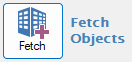
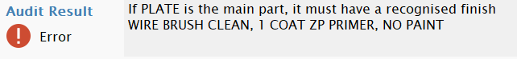

---
---



<!-- [Contents](README.md) | [Concepts](core-concepts/overview.md) | [Configuration](configuration/overview.md) | [Main](user-interface/main-window.md) | [Audits](user-interface/audit-definition-editor.md) | [Examples](examples/overview.md) | [Troubleshooting](troubleshooting/overview.md) -->

---

# Getting Started with ObChecked

## Purpose

This guide explains the simplest workflow for running an audit in **ObChecked** using default settings.

The goal is to understand the basic structure of an audit and how rules are evaluated.

ObChecked audits are built using a hierarchy of rule definitions that progressively narrow down what is being checked.

```
Group → Subject → Match → Target → Condition
```

Each level refines the scope of the rule until a specific property value is evaluated.

---

# Step 1 — Select Objects from Tekla

ObChecked evaluates the objects currently selected in the Tekla model.

Typical selections include:

- Parts  
- Bolts  
- Components  

If **components** are selected, ObChecked automatically expands them and includes their child parts and bolts.

This ensures that no relevant objects are missed during validation.

> Currently `Select assemblies` is not supported. Only `Select Components` or `Select parts in components` will return part objects.

---

# Step 2 — Fetch the objects

Once objects are selected, click Fetch (Top Left) and ObChecked imports properties for each object and displays them in the main list.



For each object:

1. Each column defined in Column Definitions contains a property from the model
2. Audits listed under Audit Definitions are automatically processed at the same time

Any rule violations are flagged in the grid.

---

# Step 3 — Review the Results

Audit results appear in the **ObChecked grid**.

Each row represents an object, and each column represents a property being evaluated.

Cells are flagged using severity levels:

- **Okay** – value satisfies the rule — *blue text*
- **Info** – informational message — *blue background*
- **Warn** – potential issue detected — *yellow background* 
- **Error** – rule violation — *red background*
- **Unknown** – rule could not be evaluated — *grey background*

This allows users to quickly identify which objects require attention.

---

# Step 4 — Inspect Messages

Selecting a flagged cell displays additional information in the **message panel**.



Messages can explain:

- Which rule was evaluated  
- What value was expected  
- What value was detected

Messages may also include **tokens** that reference:

- Column values: use token `{COLUMN_NAME}` to dispplay the value of a cell
- Expected values: use token `{@OKAY}`
  - `@` distinguishes it from column names.
  - It should work for any flag specified by the audit: `@OKAY`, `@INFO`, `@WARN`, `@ERROR`.

Messages can be multi-lined and are **fully customisable** in the Audit Definitions dialog.

This helps users understand exactly why a value failed validation.

---

# Example Workflow

A typical ObChecked workflow might look like this:

1. Select a group of beams in the Tekla model  
2. Click Fetch to import object data and display results
3. Review flagged results (use filters to focus on severe warnings)
4. Use buttons on the top-right to select objects in the Tekla model
    - option to zoom to objects
    - option to include child objects (cuts/welds etc)
    - option to include father component (to select comppnent object as well as parts)
    - select objects given selected option toggles
5. Objects can be updated in Tekla as required
6. Use ObChecked to reselect those objects in the model again
7. Click Fetch to re-import objects and update grid with updated values

---

# What to Learn Next

To create more advanced audits, the following concepts are important:

- Audit hierarchy (Group → Subject → Match → Target → Condition)  
- Grid column configuration  
- Flag severity levels  
- Message tokens  
- Audit examples  

These topics are explained in the next sections of the documentation.
