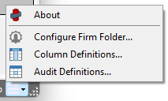

## Overview

Tekla model objects contain a large amount of data.
In practice, most companies enforce internal standards that require certain values to follow specific rules.

These rules can relate to profiles, materials, naming conventions, prefixes, paint finishes, lengths, phases, and custom user-defined attributes.

ObChecked is a tool designed to verify the internal consistency of Tekla model objects by applying configurable audit rules.

Instead of manually reviewing objects one at a time, ObChecked evaluates the data automatically and flags values that do not conform to the defined standards.

The rules that determine consistency are highly flexible and can be adapted to suit different company workflows, modelling standards, or project requirements.

---

## Typical Validation Examples

ObChecked can evaluate a wide range of modelling rules.
Some common examples include:

### Profile and Material Rules

Certain part profiles may only support specific materials.

Example rule:

* A beam profile may only be valid with a defined steel grade.
* Any object assigned an unsupported material can be flagged.

### Stock Length Validation

Profiles may only be available in certain stock lengths depending on beam depth.

Example rule:

* If a beam length exceeds available stock lengths for that profile, it can be flagged.

### Prefix Rules

Profiles or naming conventions may determine the correct part prefix.

Example rule:

* A specific profile family may require a particular prefix value.

### Assembly Rules

Assembly properties may depend on material type or main part configuration.

Example rule:

* Certain paint finishes may only be valid for specific materials.

### Naming Conventions

Object names can imply required assembly prefixes or class values.

Example rule:

* Parts with a particular naming pattern must use a defined assembly prefix.

### Phase-Based Rules

Assembly prefixes or classifications may depend on the phase number assigned to the object.

Example rule:

* Assemblies in specific phases may require different prefix conventions.

### Required Custom Properties

Custom User Defined Attributes (UDAs) may be required for downstream systems.

Example rule:

* Missing or invalid UDA values can be flagged automatically.

---

## Object Types Supported

ObChecked audits multiple Tekla object types.

### Parts

Most auditing workflows operate on parts and assemblies, where the majority of model data resides.

### Bolts

Bolt properties such as tolerances, grades, and lengths can also be validated.

Example rules include:

* checking bolt length ranges
* validating bolt grades
* ensuring tolerances match the bolt type

### Components

When components are selected, ObChecked expands them into their child objects.

This ensures that:

* parts inside components are included in audits
* bolt objects created by components are also evaluated

As a result, selecting components will not cause any child objects to be excluded from validation.

---

## Configurable Grid and Data Columns

The main ObChecked grid is fully configurable.

Columns can display a wide range of Tekla properties and can be adjusted to suit the user's workflow.

Capabilities include:

* showing basic part information
* hiding or displaying selected properties
* reordering columns
* customising which properties appear in the grid

Columns support both:

* **ReportProperty values**
* **UserProperty values**

This means that nearly any property accessible in a Tekla template can also be displayed as a column in ObChecked.

Custom properties defined by users or company standards can therefore be included in the grid.

*Access all properties via the main menu in the bottom right corner*

---

## Flagging and Severity Levels

Audit results are represented using a set of flag severity levels.

Available flags include:

* **Okay** – value satisfies the rule
* **Info** – informational message
* **Warn** – potential issue detected
* **Error** – rule violation
* **Unknown** – rule could not be evaluated

These flags allow the grid to provide a clear overview of model health and highlight which objects require attention.

---

## Detailed Error Messages

Each flagged cell can contain an associated message explaining the issue.

When a user selects a cell, the information panel can display:

* the rule that failed
* the expected value or range
* the actual value detected

Messages support tokens, allowing dynamic information to be inserted into the description.

For example, a message can reference:

* column names
* expected results
* detected values

This helps users understand why an object failed validation and how to correct it.

---

## Intended Audience

ObChecked is designed for Tekla users who need to ensure model data follows defined standards.

Typical users include:

* steel detailers
* BIM coordinators
* engineers
* quality control teams
* organisations maintaining internal modelling standards

Any workflow where object properties must remain consistent across a model can benefit from automated validation using ObChecked.
