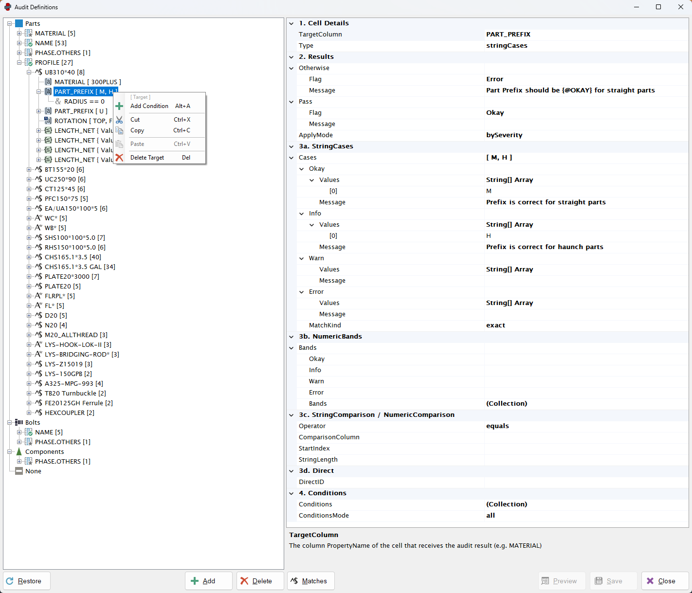
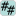

---
---



<!-- [Contents](../README.md) | [Concepts](../core-concepts/overview.md) | [Configuration](../configuration/overview.md) | [Main](../user-interface/main-window.md) | [Audits](../user-interface/audit-definition-editor.md) | [Examples](../examples/overview.md) | [Troubleshooting](../troubleshooting/overview.md) -->

---

# Audit Definition Editor

The **Audit Definition Editor** is used to create and modify audit rules.  
Rules are organised in a hierarchical structure that defines how each row in the grid is evaluated.

<!--  -->
<a href="https://torpid-prey.github.io/ObChecked-docs/screenshots/interface-audit-definition.png">
  
</a>

This page describes the **user interface** used to create audit rules.  
For detailed explanations of the underlying logic, see the Core Concepts pages:

- [Subject Node](../core-concepts/subject.md)
- [Match Node](../core-concepts/match.md)
- [Target Node](../core-concepts/target.md)
- [Condition Node](../core-concepts/condition.md)

# Audit Tree

The **Audit Tree** defines the structure of the entire audit system.

The hierarchy is organised as follows:

```
Group
└─ Subject
  └─ Match  
    └─ Target  
      └─ Condition  
```

Each node represents one stage of the auditing process.

Under each **Group** node are the Subject nodes loaded from the corresponding `.aud` files.  
Because these files are read directly from disk, Subject nodes are currently displayed in **alphabetical order** and cannot be reordered.

Each node contains its own nested collection:

- Group → collection of Subjects
- Subject → collection of Matches  
- Match → collection of Targets  
- Target → collection of Conditions  


# Node Management

Right-clicking any node opens a **context menu**.

Available actions include:

- Add
- Cut
- Copy
- Paste
- Delete

Actions are enabled or disabled depending on the selected node type.

The **Add** and **Delete** buttons below the tree provide quick access to these actions.


## Reordering

Nodes can be reordered by **drag-and-drop**.

This applies to all node types **except Subject nodes**, which follow file order.


## Copy and Paste

Nodes may be copied or moved to other compatible locations in the tree.

This is useful when creating similar rules that only require minor adjustments.

Important notes:

- Nodes can only be pasted into compatible parent types
- Duplicate nodes are **not allowed when saving**
- However duplication during editing is supported so nodes can be copied and modified

At present, copy and paste operations are limited to the **current editor instance**.


# Node Display

Each node displays important information directly in the tree.

This allows the structure of the audit to be understood at a glance.


## Subject Nodes

Display:

- the subject property name
- the number of Match nodes

Icons differ depending on the **match flag behaviour**:

| Icon | Value |
|--|--|
|  | Okay |
|  | Info |
|  | Warn |
|  | Error |
|  | Unknown |
|  | None |

## Match Nodes

Display:

- the match property
- the number of Target nodes

Icons differ depending on the **match type**:

| Icon | Value |
|--|--|
|  | Exact |
|  | Like |
|  | Regex |

## Target Nodes

Display:

- the target column
- the expected value or comparison

Icons differ depending on the **target type**:

| Icon | Value |
|--|--|
|  | StringCases |
|  | NumericBands | 
|  | StringCompare | 
|  | NumericCompare | 
|  | Direct | 

ApplyMode is also indicated:

| Icon | Value |
|--|--|
|  | onFirstMatch |
|  | onAnyMatch |

## Condition Nodes

Condition nodes display the condition itself.

Icons differ depending on the **ConditionMode** of the parent target:

| Icon | Value |
|--|--|
|  | All |
|  | Any |


# Property Grid

Selecting a node displays its properties in the **Property Grid**.

This panel allows all properties of the selected node to be edited.

Features include:

- dropdown lists for properties with fixed options
- editable text fields
- multi-line message fields
- numeric input controls

This is where **flag severity and messages** are defined.

These messages appear when a user clicks a cell in the main grid.


# Editing Collections

Some properties contain **collections of values**.

Collections can be edited in two ways.


## Using the Tree

Most collections are easiest to edit directly in the tree by adding child nodes.


## Using the Collection Editor

Some collections are edited using the `...` button in the property grid.

This opens a dialog window where items can be added or modified.

This method is required for:

- NumericBands
  - Target → NumericBands → Bands
- String Arrays
  - Target →  StringCases → Values
  - Condition → Right Comparison Value Array → Values

NumericBands are edited this way because individual bands do not have their own nodes.


# Editing String Arrays

Properties that contain string arrays cannot be edited directly in the text field.

Instead, use the `...` button to open the collection editor.

Multi-line text fields (such as **flag messages**) may be edited directly in the property grid.


# Property Help Panel

The **Help Panel** displays a description of the currently selected property.

Selecting a property in the grid will show its explanation here.

The panel can be resized by dragging its boundary to increase or decrease the visible area.


# Previewing Changes

After modifying rules, changes can be **previewed**.

Preview applies the current audit configuration to the main grid without saving.

This allows rules to be tested before committing them to file.

After previewing, you can either:

- Save the changes to file
- Revert to the previous configuration


# Match Results Viewer

The [Matches](../core-concepts/condition.md#regex-match-groups) button opens the Match Results window.

When used with:

- selected rows in the main grid
- a selected node in the audit tree

the viewer displays match results for each selected row.

This includes:

- whether the Subject matched
- the results of Match nodes
- regex match groups

This tool is especially useful when developing or debugging **regex-based rules**.
