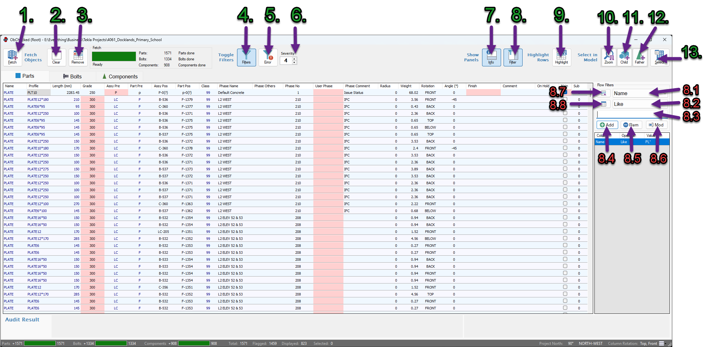
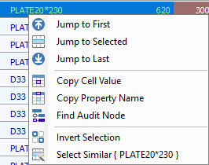

[Contents](../README.md) | [Concepts](../core-concepts/overview.md) | [Configuration](../configuration/overview.md) | [Main Window](../user-interface/main-window.md) | [Audits](../user-interface/audits-window.md) | [Examples](../examples/overview.md) | [Troubleshooting](../troubleshooting/overview.md)

---

# Main Window

The ObChecked main window is where objects are fetched from the Tekla model, displayed in the grid, and evaluated against audit rules.

Most operations are performed using the toolbar above the grid.

<!--  -->

<i>The numbered screenshot can be used here to visually identify each control.</i>

| [1](#1-fetch) | [2](#2-clear) | [3](#3-remove) | [4](#4-toggle-filters) | [5](#5-filter-by-severity) | [6](#6-severity-value) | [7](#7-info-panel-toggle) | [8](#8-filter-panel-toggle) | [9](#9-highlight-rows) | [10](#10-zoom-to-objects) | [11](#11-select-child-objects) | [12](#12-select-father-components) | [13](#13-select-in-model) |

---

# Data Controls (Left to right)

## 1. Fetch

Fetch retrieves the currently selected objects from the Tekla model and loads them into the grid.

The properties retrieved depend on the **current column configuration**.

Fetch will:

- read the selected objects
- retrieve all defined column values
- evaluate audit rules for each row

[Top](main-window.md#main-window)

---

## 2. Clear

Clear removes all rows from the grid.

This action also reloads the **current column schema**.

This can be useful when another user has modified shared column definitions and the schema needs to be refreshed.

[Top](main-window.md#main-window)

---

## 3. Remove

Remove deletes the **selected rows from the grid dataset**.

This does not affect the Tekla model.

This should not be confused with filters, which only hide rows temporarily.

[Top](main-window.md#main-window)

---

# Filtering

## 4. Toggle Filters

Enable Filters toggles whether the active filter list is applied to the grid.

When disabled, all rows are shown regardless of the filters defined in the filter panel.

[Top](main-window.md#main-window)

---

## 5. Filter by Severity

Filter Severity adds a filter that hides rows whose **maximum audit flag severity** is below the selected value.

The filter works together with the **Severity Value** control.

[Top](main-window.md#main-window)

---

## 6. Severity Value

Severity Value determines the threshold used by the Filter Severity option.

Values range from **1 to 5**, corresponding to the audit flag levels.

Example:

If Severity Value is set to **3** and Filter Severity is enabled:

- rows with **Warn**, **Error**, or **Unknown** will be shown
- rows with **Okay** or **Info** will be hidden

Changing the severity value updates the filter threshold immediately.

[Top](main-window.md#main-window)

---

# Panels

## 7. Info Panel Toggle

This button shows or hides the **Message Panel**.

The Info Panel displays:

- the audit flag of the selected cell
- the audit message associated with the cell
- button descriptions when hovering over toolbar controls

[Top](main-window.md#main-window)

---

## 8. Filter Panel Toggle

This button shows or hides the **Filter Panel**.

The Filter Panel allows users to define custom column filters.

[Top](main-window.md#main-window)

---

# Filter Panel

The Filter Panel contains tools for creating column-based filters.

Each filter consists of:

### 8.1 Column Name
- Select from list of available columns for the current group tab

### 8.2 Operator
- Select what kind of comparison you want to filter results by

### 8.3 Comparison Value
- Enter a value that you want results to be / include / exclude (depending on operator)

*Filters can be combined to show rows that match* **all defined filters**

### 8.4 Add Filter
- Add the filter as a new item to the collection of active filters

### 8.5 Remove Filter
- Remove the selected filter from the collection of active filters

### 8.6 Modify Filter
- Update the selected filter with new details

*Double click on a filter in the list to return the details back into the input fields*

### 8.7 Filter by Selection
- Creates a temporary **working set** based on the currently selected rows.
- Filters can then be applied to the working set using the filter list.

### 8.8 Clear Selection Filter
- Removes the working set and returns the grid to the full dataset.

[Top](main-window.md#main-window)

---

# Model Interaction

## 9. Highlight Rows

Highlight Rows finds the currently selected objects in the Tekla model and highlights the corresponding rows in the grid.

This does not fetch or update object values.

It simply locates the rows already present in the dataset.

[Top](main-window.md#main-window)

---

# Selection objects in Tekla model

*Toggles impact the next selection. They do not themselves select objects.*

## 10. Zoom to Objects

This is a toggle. When enabled, the model view will zoom to the selected objects when selecting row objects.

[Top](main-window.md#main-window)

---

## 11. Select Child Objects

This is a toggle. When enabled, selecting an object will also select its related child objects when selecing row objects.

- cuts
- welds

[Top](main-window.md#main-window)

---

## 12. Select Father Components

This is a toggle. When enabled, the component cone of a selected object will also be selected when selecting row objects.

[Top](main-window.md#main-window)

---

## 13. Select in Model

This button selects the currently highlighted rows in the Tekla model.

Additional behaviours are affected by the selection toggles described above.

[Top](main-window.md#main-window)

---

# Typical Workflow

A common workflow when auditing objects is:

1. Select objects in the Tekla model
2. Press **Fetch**
3. Review audit results in the grid
4. Use filters or sort columns to group common issues
5. Highlight rows with a common issue
6. Select objects in model _(keep rows selected in list)_
7. Make batch-corrections to selected objects in Tekla
8. Press **Fetch** again to update the selected rows

---

# Grid Context Menu

Right-clicking the main grid opens a context menu with navigation and utility tools.

 

These options help locate rows, copy information, and interact with audit rules.

---

### Jump to First
- Scrolls the grid to view the first row without changing selection

### Jump to Selected
- Scrolls the grid so the currently selected row becomes visible and central

### Jump to Last
- Scrolls the grid to view the last row without changing selection

---

### Copy Cell Value
- Copies the value of the selected cell to the clipboard.

### Copy Property Name
- Copies the **column property name** to the clipboard.
- This is useful when creating audit rules, where column names must be referenced exactly.

Example usage:

    SubjectColumn: PROFILE
    TargetColumn: MATERIAL

### Find Audit Node
- This option is only available when the **Audit Definition window** is open.
- Locates the node responsible for the selected cell's aduit result.

---

### Invert Selection
- Inverts row selection so all deselected rows are selected and vice versa.

### Select Similar
- Selects all rows where the value of the selected cell matches the current value.
- This can be useful for quickly grouping objects with the same property value.
